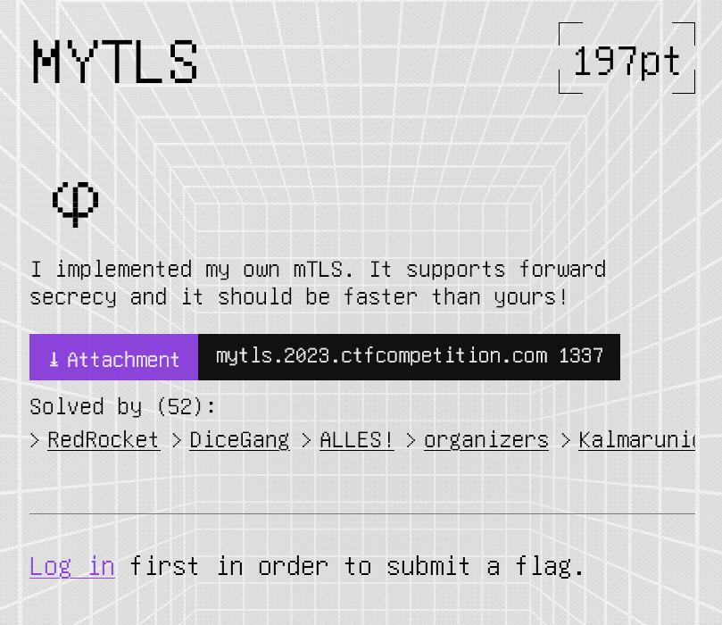

# Example Write Up

by whomever authored this write-up

### Challenge Text

Paste a screenshot of or copy and paste the challenge text. This is to introduce the reader to the challenge, to get them in the same mindset as you while solving. 



It is much cleaner to keep all your images and other assets in their own folders. 

# Table of Contents - Optional, but MDAIO can really help with this.

- [Example Write Up](#example-write-up)
    - [Challenge Text](#challenge-text)
- [Table of Contents - Optional, but MDAIO can really help with this.](#table-of-contents---optional-but-mdaio-can-really-help-with-this)
- [Describe Your Though Processes](#describe-your-though-processes)
    - [1. First Heading](#1-first-heading)
    - [2. Second Heading](#2-second-heading)
      - [2.1 Sub-Heading](#21-sub-heading)
- [Move on to your main exploit or solutions here.](#move-on-to-your-main-exploit-or-solutions-here)
    - [1. Structure this the same as above](#1-structure-this-the-same-as-above)
      - [1.1 It helps make things easy to follow.](#11-it-helps-make-things-easy-to-follow)
- [Getting the Flag](#getting-the-flag)
    - [1. If it makes sense, separate the "final attack" into a separate category.](#1-if-it-makes-sense-separate-the-final-attack-into-a-separate-category)
    - [2. The flag](#2-the-flag)


# Describe Your Thought Processes

Give a quick primer on what started you on your path to success, you can include what did and what didn't work. Any grand ideas or existing knowledge that lead you to the eventual solution. 

- [ ] You can include your goals.
- [ ] What worked. 
- [ ] Where your knowledge gaps were. 
- [ ] What you learned.

### 1. First Heading 

Keep it organized by putting the various phases of your solution under headings and sub-headings. 

[Mind your markdown](https://www.markdownguide.org/extended-syntax/) it dramatically improves the professionalism of your write up.

VSCode extensions like Markdown All in One (MDAIO) can really help with writing a markdown document. 

### 2. Second Heading 

An example could be Researching the encryption or algorithms the challenge used here.

> Include images, links, and references. 
> The right-angle bracket is how you "quote" something. 

If you used any tools, put it here as well. 

#### 2.1 Sub-Heading

Then include how YOU used that research. 

Try to include any scripts or commands you used as well. The intention of this doc is to teach you, teach the reader, and improve your technical writing skills. 

# Move on to your main exploit or solutions here. 

### 1. Structure this the same as above

```bash
$ the triple backticks allow you to "fence" code blocks. 
$ As well as tell MD what language it should highlight as.
$ Remember, images, scripts, and commands!
```

#### 1.1 It helps make things easy to follow. 

# Getting the Flag

### 1. If it makes sense, bring the "final attack" down to the bottom to emphasize that *this* was the solution. 

### 2. The flag

Try to post the flag using `backticks`
